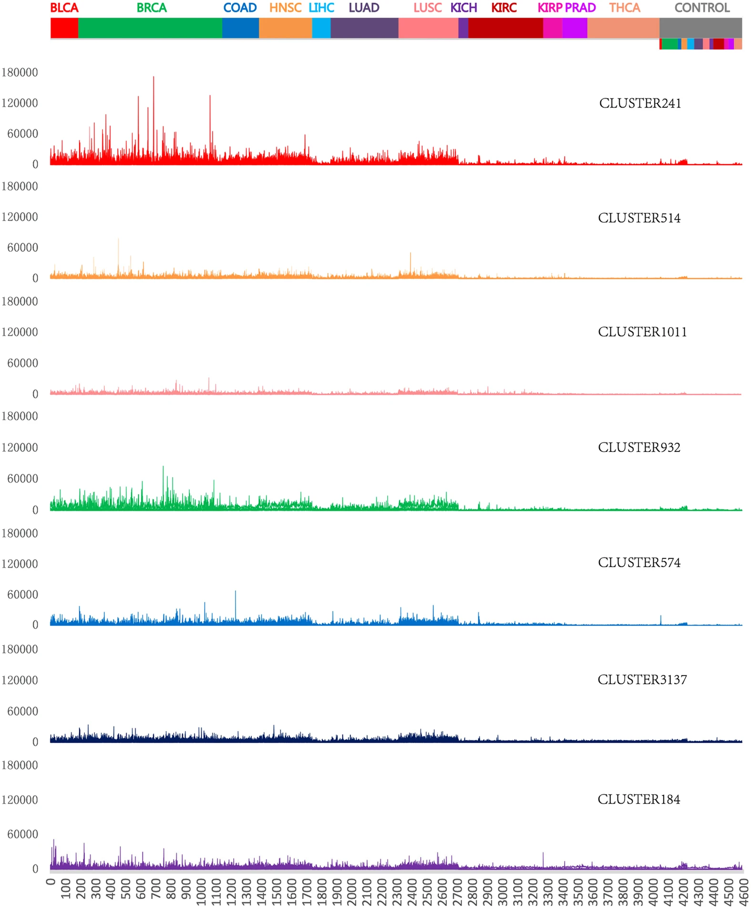

## **Summary of the study "Large-scale RNA-Seq Transcriptome Analysis of 4043 Cancers and 548 Normal Tissue Controls across 12 TCGA Cancer Types"**

### Authors (@slack): Shekoni Oluwatosin (@OluwatosinF1)
### Contributors (@slack): Tomilayo Fadairo (@TomiDbeloved)

## **Introduction**

The study, **"Large-scale RNA-Seq Transcriptome Analysis of 4043 Cancers and 548 Normal Tissue Controls across 12 TCGA Cancer Types"**, focuses on analyzing and comparing RNA-Seq transcriptome data. The research spans over 4043 cancer samples and 548 normal tissues across 12 types of cancer, sourced from The Cancer Genome Atlas (TCGA). The aim is to identify gene expression alterations that may serve as diagnostic or therapeutic targets, and provide insights into tumorigenesis and metastasis mechanisms.

## **Methods**

The study involves RNA-Seq data analysis, focusing on differential expression between cancerous and normal tissues. Genes were clustered into co-regulated gene sets, using tools like APCluster for clustering and GSAASeqSP for gene set association analysis. Pathway enrichment analysis was also conducted using GO analysis and KEGG pathways.

<figure>
  
  <figcaption>Figure 1 demonstrates the pipeline used for the analysis of RNA-Seq data, providing a clear overview of the workflow employed.</figcaption>
</figure>

### Differential Gene Expression

The study discovered a substantial number of differentially expressed (DE) genes across various cancer types. However, commonality between cancers was limited; only about 20% of DE genes were shared between cancer types. LUAD and LUSC, both lung cancers, had the highest overlap with 55% common DE genes.

### Cross-Cancer Gene Signatures

Seven cross-cancer gene signatures were identified. One of the most notable was a 14-gene signature that could accurately differentiate between normal and cancerous samples. For instance, LOOCV accuracy for lung cancer (LUAD) was 95.68%, highlighting the potential diagnostic applications of these gene signatures. A lung cancer-specific signature involving genes like **SFTPA1** and **SFTPA2** was also identified, achieving 100% LOOCV accuracy on external datasets (GSE5364).

<figure>
  
  <figcaption>Figure 2 shows the gene clusters derived from the cross-cancer analysis, which highlighted several cell cycle-related genes as significant contributors to cancer progression.</figcaption>
</figure>

### Pathway and Disease Associations

Gene set enrichment analyses indicated that many DE genes are involved in critical pathways like the cell cycle and DNA replication. This was consistent across multiple cancer types, underlining the importance of cell cycle dysregulation in tumorigenesis. Some gene signatures were cancer-specific, such as the cluster associated with bladder cancer (BLCA), enriched for retinoblastoma pathway genes.

### Validation of Gene Signatures

Validation of gene signatures on non-TCGA datasets showed high predictive accuracy, with cross-cancer signatures performing well across multiple datasets. For instance, in GSE40419, a dataset of lung cancer samples, the 14-gene signature achieved 97.14% accuracy.

## **Conclusion**

This study offers significant insights into gene expression alterations across various cancers and emphasizes the importance of cell cycle-related pathways in tumorigenesis. The identified gene signatures hold potential for improving cancer diagnostics and treatment strategies.

### References
This summary is based on the original paper titled **'Large-scale RNA-Seq Transcriptome Analysis of 4043 Cancers and 548 Normal Tissue Controls across 12 TCGA Cancer Types',** authored by Peng, L., Bian, X., Li, D. et al.(2015) and published in Nature, Scientific Reports 5, Artcle number: 13413 (2015). Available at https://doi.org/10.1038/srep13413
