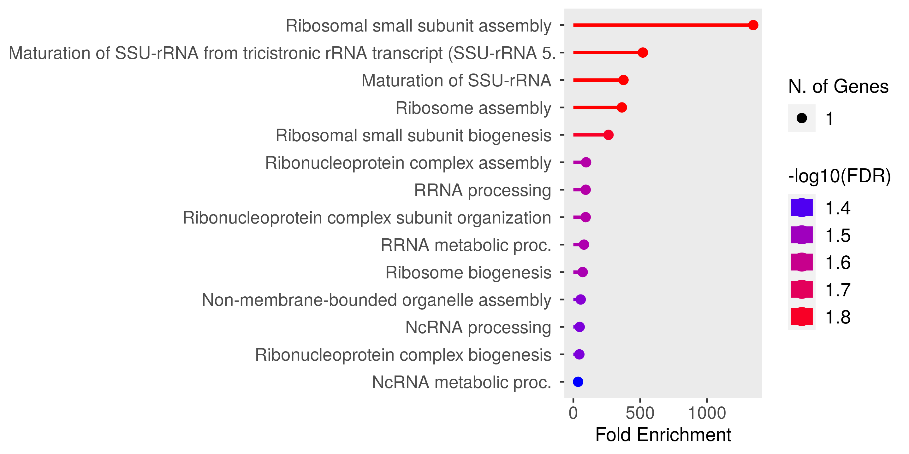
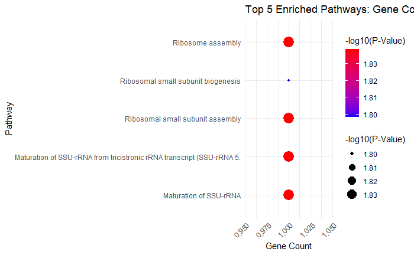

# Glioblastoma Gene Expression and Functional Enrichment Analysis

### Authors (@slack): Shekoni Oluwatosin (@OluwatosinF1)
### Contributors (@slack): Chioma Onyido (@Omabekee)

### GitHub Code: http://bit.ly/48oOjdS

## 1\. Introduction

This analysis explores the gene expression data of glioblastoma, focusing on differentially expressed genes (DEGs). 
The main objectives were to visualize gene expression patterns using heatmaps, identify upregulated and downregulated 
genes, and perform functional enrichment analysis to understand the biological processes involved in glioblastoma 
progression.

## 2\. Heatmap Visualization

Heatmaps were used to visualize the expression patterns of the top 500+ DEGs. The heatmaps were colored using both diverging 
and sequential palettes for better interpretation of the results. The heatmaps revealed two distinct clusters:

**1\.** Group 1: Samples 1-5.

**2\.** Group 2: Samples 6-10.

This separation suggests a difference in expression profiles between the two groups, which could indicate different biological 
conditions or stages of glioblastoma.

### 2.1 Diverging Colour Palette

<figure>  
    
  <figcaption>Figure 1: Gene expression diverging heatmap</figcaption>  
</figure>

### 2.2  Sequential Color Palette

<figure>  
    
  <figcaption>Figure 2: Gene expression sequential heatmap</figcaption>  
</figure>

### 2.3 Clustering Methods in the Heatmap

Heatmaps were created using three different clustering methods: clustering by genes (rows), clustering by samples 
(columns) and clustering by both genes and samples (rows and columns).

<figure>  
    
  <figcaption>Figure 3: Clustering by genes heatmap</figcaption>  
</figure>

&nbsp;

<figure>  
    
  <figcaption>Figure 4: Clustering by samples heatmap</figcaption>  
</figure>

&nbsp;

<figure>  
    
  <figcaption>Figure 5: Clustering by genes and samples heatmap</figcaption>  
</figure>

## 3\. Identification of Significant Genes

The glioblastoma dataset was processed to calculate the log2 fold changes between two groups of samples. The cut-off values 
for significance were set as:

**A\.** Fold change (log2FC): ±1.0

**B\.** P-value: 0.05

This analysis identified:

**1\.** 2 Upregulated genes

**2\.** 10 Downregulated genes

These gene lists were used for functional enrichment analysis.

<figure>  
    
  <figcaption>Figure 6: Volcano plot showing the significant genes</figcaption>  
</figure>

## 4\. Functional Enrichment Analysis

Using the list of DEGs, functional enrichment analysis was carried out with ShinyGO (Ge et al., 2020\). The top 5 enriched pathways were identified 
based on FDR values (False Discovery Rate). These pathways primarily revolved around ribosome biogenesis and RNA processing, 
processes commonly linked with cancer progression.

<figure>  
    
  <figcaption>Figure 7: Key Pathways and Biological Processes Associated With Upregulated Genes</figcaption>  
</figure>

### Top 5 Enriched Pathways:

**1\.** Ribosomal small subunit assembly

**2\.** Maturation of SSU-rRNA

**3\.** Ribosome assembly

**4\.** Ribonucleoprotein complex assembly

**5\.** Ribosome biogenesis

The results indicate that these pathways play a crucial role in glioblastoma, contributing to the rapid and uncontrolled 
proliferation of cells.

## 5\. Visualisation of Top 5 Upregulated Pathways

The dot plot below represents the top 5 upregulated pathways enriched in the dataset, where the size of the dots corresponds to the number 
of genes involved in each pathway, and the color represents the significance (based on -log10 of the FDR value).

The redder the dot, the more significant the pathway is, based on its FDR value.

<figure>  
    
 <figcaption>Figure 8: Top 5 Enriched Pathways Associated with Upregulated Genes</figcaption>  
</figure>

### 5.1 Biological Significance of Top 3 Enriched Pathways

**1\. Ribosomal Small Subunit Assembly:** This pathway involves the assembly of the small ribosomal subunit, essential for 
protein synthesis. In glioblastoma, increased ribosome production supports the rapid cell growth and division typical of 
tumor cells.

**2\. Maturation of SSU-rRNA**: This process is critical for forming functional ribosomes. Dysregulated rRNA processing in 
glioblastoma may enhance protein production, contributing to tumor progression.

**3\. Ribosome Assembly**: Ribosome assembly combines rRNAs and ribosomal proteins, crucial for maintaining the high rates of 
protein synthesis needed for cancer cell proliferation in glioblastoma.

## Conclusion

The analysis highlighted critical pathways involved in glioblastoma, particularly those related to ribosome biogenesis and RNA 
processing. These pathways are essential for the rapid growth of tumor cells, and targeting them may provide potential 
therapeutic avenues for treating glioblastoma. The heatmap clustering also demonstrated clear differences between two 
groups of samples, which could reflect different disease states or subtypes of glioblastoma.

## REFERENCES

1. Mager, W. H., & Kruiswijk, T. (1995). Ribosomal Proteins and Ribosome Biogenesis in Eukaryotes. Molecular Biology Reports, 
22(3), 81-98. https://doi.org/10.1007/BF00983542

2. Ge, S. X., Jung, D., & Yao, R. (2020). ShinyGO: A graphical gene-set enrichment tool for animals and 
plants. Bioinformatics, 36(8), 2628–2629. https://doi.org/10.1093/bioinformatics/btz931

3. Pelletier, J., Thomas, G., & Volarevic, S. (2018). Ribosome Biogenesis in Cancer: New Players and Therapeutic Avenues. 
Nature Reviews Cancer, 18(1), 51-63. https://doi.org/10.1038/nrc.2017.104

4. Buszczak, M., Signer, R. A., & Morrison, S. J. (2014). Cellular Differences in Protein Synthesis Regulate Tissue Homeostasis. 
Cell, 159(2), 242-251. https://doi.org/10.1016/j.cell.2014.09.016

5. Verhaak, R. G. W., Hoadley, K. A., Purdom, E., Wang, V., Qi, Y., Wilkerson, M., ... & Hayes, D. N. (2010). Integrated 
Genomic Analysis Identifies Clinically Relevant Subtypes of Glioblastoma Characterized by Abnormalities in PDGFRA, 
IDH1, EGFR, and NF1. Cancer Cell, 17(1), 98-110. https://doi.org/10.1016/j.ccr.2009.12.020

6. Quin, J. E., Devlin, J. R., Cameron, D., Hannan, K. M., & Pearson, R. B. (2014). Targeting the Nucleolus for Cancer 
Intervention. Biochimica et Biophysica Acta (BBA) - Molecular Basis of Disease, 1842(6), 
802-816. https://doi.org/10.1016/j.bbadis.2013.12.009

7. Hynes, N. E., & Lane, H. A. (2005). ERBB Receptors and Cancer: The Complexity of Targeted Inhibitors. Nature Reviews 
Cancer, 5(5), 341-354. https://doi.org/10.1038/nrc1609